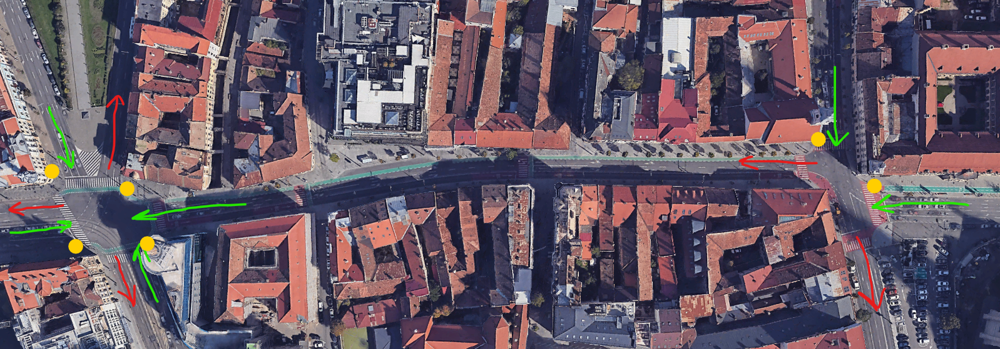

<!-- Improved compatibility of back to top link: See: https://github.com/othneildrew/Best-README-Template/pull/73 -->

<!--
*** Thanks for checking out the Best-README-Template. If you have a suggestion
*** that would make this better, please fork the repo and create a pull request
*** or simply open an issue with the tag "enhancement".
*** Don't forget to give the project a star!
*** Thanks again! Now go create something AMAZING! :D
-->

<!-- PROJECT SHIELDS -->
<!--
*** I'm using markdown "reference style" links for readability.
*** Reference links are enclosed in brackets [ ] instead of parentheses ( ).
*** See the bottom of this document for the declaration of the reference variables
*** for contributors-url, forks-url, etc. This is an optional, concise syntax you may use.
*** https://www.markdownguide.org/basic-syntax/#reference-style-links
-->
[![Cosmin][linkedin-cosmin-shield]][linkedin-cosmin-url]
[![Radu][linkedin-radu-shield]][linkedin-radu-url]
[![Mara][linkedin-mara-shield]][linkedin-mara-url]

<!-- PROJECT LOGO -->
 

  

<h3 align="center">Intersections Simulation</h3>

  

    Traffic simulation at intersections using dynamic OETPNs to model and manage flow at roundabouts and traffic lights
     
    <a href="./Report.pdf"><strong>Explore the docs »</strong></a>
     
     
  

<!-- TABLE OF CONTENTS -->

  
Table of Contents

  <ol>
    <li>
      <a href="#about-the-project">About The Project</a>
      <ul>
        <li><a href="#built-with">Built With</a></li>
      </ul>
    </li>
    <li><a href="#usage">Usage</a></li>
    <li><a href="#acknowledgments">Acknowledgments</a></li>
  </ol>

<!-- ABOUT THE PROJECT -->
## About The Project

[![Simulation Screenshot][product-screenshot]](https://github.com/ciomin/intersections-simulation)

Our project simulates traffic at two main intersections — with a varying number of input and output lanes, and traffic lights — using Object Enhanced Time Petri Nets (OETPNs). These simulations are controlled by systems that adjust traffic signals dynamically based on real-time conditions to help reduce congestion during heavy traffic.

Each intersection is modeled to reflect realistic traffic behaviors and is managed by controllers that can extend green lights when there are traffic jams. The entire setup is visualized through a user-friendly graphical interface developed with Spring, making it easy to see and interact with the traffic simulation.

This project demonstrates how traffic control can be optimized in urban areas, providing a practical tool for improving flow and reducing delays in busy intersections.

(<a href="#readme-top">back to top</a>)

### Built With

* [![Java][Java]][Java-url]
* [![UML][UML]][UML-url]

(<a href="#readme-top">back to top</a>)

<!-- USAGE EXAMPLES -->
## Usage

Real intersections from Cluj-Napoca that inspired the traffic simulation model

Simplified model of the intersections

_For a demonstration of the application in action, please watch the [video](testing/test1.mp4)_

_For more information, please refer to the [Report](./Report.pdf)_

(<a href="#readme-top">back to top</a>)

<!-- ACKNOWLEDGMENTS -->
## Acknowledgments

* [Dahlia AL-JANABI](https://www.researchgate.net/profile/Dahlia-Al-Janabi)
* [Tiberiu LETIA](https://www.researchgate.net/profile/Tiberiu-Letia)

(<a href="#readme-top">back to top</a>)

<!-- MARKDOWN LINKS & IMAGES -->
<!-- https://www.markdownguide.org/basic-syntax/#reference-style-links -->
[linkedin-cosmin-shield]: https://img.shields.io/badge/-Cosmin-black.svg?style=for-the-badge&logo=linkedin&colorB=555
[linkedin-cosmin-url]: https://linkedin.com/in/cosmin-iacobut
[linkedin-radu-shield]: https://img.shields.io/badge/-Radu-black.svg?style=for-the-badge&logo=linkedin&colorB=555
[linkedin-radu-url]: https://www.linkedin.com/in/radu-calomfirescu-4a2312270/
[linkedin-mara-shield]: https://img.shields.io/badge/-Mara-black.svg?style=for-the-badge&logo=linkedin&colorB=555
[linkedin-mara-url]: https://www.linkedin.com/in/mara-martonos-1770b8251/
[product-screenshot]: images/example.png
[UML]: https://img.shields.io/badge/UML-ffff80?style=for-the-badge&logo=uml
[UML-url]: https://www.uml.org/
[Java]: https://img.shields.io/badge/Java-d0d0d0?style=for-the-badge&logo=data%3Aimage%2Fsvg%2Bxml%3Bbase64%2CPD94bWwgdmVyc2lvbj0iMS4wIiA%2FPjwhRE9DVFlQRSBzdmcgIFBVQkxJQyAnLS8vVzNDLy9EVEQgU1ZHIDEuMS8vRU4nICAnaHR0cDovL3d3dy53My5vcmcvR3JhcGhpY3MvU1ZHLzEuMS9EVEQvc3ZnMTEuZHRkJz48c3ZnIGhlaWdodD0iNTEycHgiIHN0eWxlPSJlbmFibGUtYmFja2dyb3VuZDpuZXcgMCAwIDUxMiA1MTI7IiB2ZXJzaW9uPSIxLjEiIHZpZXdCb3g9IjAgMCA1MTIgNTEyIiB3aWR0aD0iNTEycHgiIHhtbDpzcGFjZT0icHJlc2VydmUiIHhtbG5zPSJodHRwOi8vd3d3LnczLm9yZy8yMDAwL3N2ZyIgeG1sbnM6eGxpbms9Imh0dHA6Ly93d3cudzMub3JnLzE5OTkveGxpbmsiPjxnIGlkPSJfeDMxXzgxLWphdmEiPjxnPjxwYXRoIGQ9Ik0zMzMuMjgzLDMwNy4xMTdjOC44MDctNi4wMiwyMS4wMjMtMTEuMjMsMjEuMDIzLTExLjIzcy0zNC43NjgsNi4yOS02OS4zNTcsOS4xNjUgICAgYy00Mi4zMTUsMy41MDMtODcuNzc1LDQuMjIxLTExMC41OTUsMS4xNjdjLTUzLjk5Ni03LjE4NywyOS42NDctMjcuMDQ0LDI5LjY0Ny0yNy4wNDRzLTMyLjQzMy0yLjE1NC03Mi40MTMsMTcuMDcgICAgQzg0LjQyMiwzMTkuMDY2LDI0OC4zODMsMzI5LjQ4NywzMzMuMjgzLDMwNy4xMTd6IiBzdHlsZT0iZmlsbDojNTM4MkExOyIvPjxwYXRoIGQ9Ik0yNTYuNTYsMjc4LjI3N2MtMTcuMDctMzguMzYyLTc0LjY1OS03Mi4wNTQsMC0xMzAuOTlDMzQ5LjcyNyw3My43OTcsMzAxLjkzLDI2LDMwMS45MywyNiAgICBjMTkuMzE2LDc1LjkxNy02Ny45Miw5OC45MTctOTkuNDU2LDE0Ni4wODRDMTgxLjAwMSwyMDQuMzM3LDIxMi45ODYsMjM4LjkyNywyNTYuNTYsMjc4LjI3N3oiIHN0eWxlPSJmaWxsOiNGODk4MUQ7Ii8%2BPHBhdGggZD0iTTM1OS41MTgsMTE5Ljk3NWMwLjA5LDAtMTU3LjQwMywzOS4zNTEtODIuMjA1LDEyNS45NThjMjIuMTkxLDI1LjUxNi01Ljg0LDQ4LjUxNi01Ljg0LDQ4LjUxNiAgICBzNTYuMzMyLTI5LjEwOCwzMC40NTctNjUuNDk1QzI3Ny43NjIsMTk0Ljk5MywyNTkuMjU0LDE3OC4xMDMsMzU5LjUxOCwxMTkuOTc1eiIgc3R5bGU9ImZpbGw6I0Y4OTgxRDsiLz48cGF0aCBkPSJNMzU0LjAzOSwzNjIuOTk5Yy0wLjQ0OSwxLjA3OC0xLjc5NywyLjI0Ny0xLjc5NywyLjMzNiAgICBjMTE1LjI2Ni0zMC4yNzcsNzIuODYxLTEwNi44MjQsMTcuNzg3LTg3LjQxNmMtNC44NTIsMS43MDctNy4zNjUsNS42Ni03LjM2NSw1LjY2czMuMDUzLTEuMjU5LDkuODgzLTIuNjk2ICAgIEM0MDAuMzk2LDI3NS4wNDQsNDQwLjM3NywzMTguMTY4LDM1NC4wMzksMzYyLjk5OUwzNTQuMDM5LDM2Mi45OTl6IiBzdHlsZT0iZmlsbDojNTM4MkExOyIvPjxwYXRoIGQ9Ik0zOTYuNDQzLDQxOC45NzFjMCwwLDEzLjAyNywxMC42OTItMTQuMjg1LDE5LjA0N2MtNTIuMDE4LDE1LjcyMi0yMTYuMzM5LDIwLjQ4My0yNjEuOTc5LDAuNjMgICAgYy0xNi40NDEtNy4wOTksMTQuMzc0LTE3LjA3MiwyNC4wNzgtMTkuMTM3YzEwLjA2MS0yLjE1NywxNS45MDEtMS43OTksMTUuOTAxLTEuNzk5Yy0xOC4yMzgtMTIuODQ3LTExNy45NjMsMjUuMjQ3LTUwLjY3MSwzNi4xMTkgICAgQzI5Mi45NDUsNDgzLjY1Nyw0NDQuMDYxLDQ0MC40NDMsMzk2LjQ0Myw0MTguOTcxTDM5Ni40NDMsNDE4Ljk3MXoiIHN0eWxlPSJmaWxsOiM1MzgyQTE7Ii8%2BPHBhdGggZD0iTTE5NS41NTcsMzgxLjc3NmMtNzAuNzA2LDE5Ljc2Niw0My4wMzUsNjAuNTU1LDEzMy4wNTUsMjIuMDExICAgIGMtMTQuNzMyLTUuNzQ4LTI1LjMzNC0xMi4zOTctMjUuMzM0LTEyLjM5N2MtNDAuMTYsNy42MzctNTguNzU2LDguMTc1LTk1LjIzMyw0LjA0MyAgICBDMTc3Ljk0OCwzOTIuMDE5LDE5NS41NTcsMzgxLjc3NiwxOTUuNTU3LDM4MS43NzZMMTk1LjU1NywzODEuNzc2eiIgc3R5bGU9ImZpbGw6IzUzODJBMTsiLz48cGF0aCBkPSJNMzU3LjA5Miw0NjkuMTAzYy03MC43MDUsMTMuMjk2LTE1Ny45NDEsMTEuNzcxLTIwOS42MDIsMy4yMzNjMC0wLjA4OCwxMC42MDIsOC43MTYsNjUuMDQ2LDEyLjIyICAgIGM4Mi44MzQsNS4zMDIsMjEwLjA1MS0yLjk2NiwyMTMuMDE2LTQyLjEzNkM0MjUuNTUzLDQ0Mi40Miw0MTkuODAzLDQ1Ny4yNDUsMzU3LjA5Miw0NjkuMTAzTDM1Ny4wOTIsNDY5LjEwM3oiIHN0eWxlPSJmaWxsOiM1MzgyQTE7Ii8%2BPHBhdGggZD0iTTMxNy45MjIsMzQzLjE0NGMtNTMuMTg4LDEwLjI0My04NC4wMDMsOS45NzMtMTIyLjkwNCw1LjkzICAgIGMtMzAuMDk4LTMuMTQ1LTEwLjQyMi0xNy42OTgtMTAuNDIyLTE3LjY5OGMtNzcuOTgyLDI1Ljg3NCw0My4zMDQsNTUuMTY0LDE1Mi4yODEsMjMuMjY5ICAgIEMzMjUuMjg5LDM1MC42MDEsMzE3LjkyMiwzNDMuMTQ0LDMxNy45MjIsMzQzLjE0NHoiIHN0eWxlPSJmaWxsOiM1MzgyQTE7Ii8%2BPC9nPjwvZz48ZyBpZD0iTGF5ZXJfMSIvPjwvc3ZnPg%3D%3D
[Java-url]: https://www.java.com/en/
